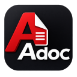

<p align="center">
  
</p>

# AdocWeave for Zed

[](https://github.com/KeishiS/adocweave/actions/workflows/ci.yml?query=branch%3Amain)
[](LICENSE)

AdocWeave adds diagnostics, navigation, completion, and formatting to AsciiDoc documents in Zed.

## Installation

Install the `AsciiDoc` extension from Zed's Extensions view first. It provides the language definition and syntax highlighting required by AdocWeave.

AdocWeave is not yet available from the official Zed extension registry. To use a repository checkout, choose **Install Dev Extension** and select the `editors/zed` directory.

## Language Server

The extension requires AdocWeave 0.51.0 or later. It uses the first available executable from:

1. The absolute path in `lsp.adocweave.binary.path`.
2. `adocweave` in the environment inherited by Zed.
3. The latest stable AdocWeave release, downloaded automatically.

The extension and executable versions do not need to match. To use a specific executable, add its absolute path to Zed settings:

```json
{
  "lsp": {
    "adocweave": {
      "binary": {
        "path": "/absolute/path/to/adocweave"
      }
    }
  }
}
```

See [Installation and updates](https://github.com/KeishiS/adocweave/blob/main/docs/user-guide/release-installation.adoc#zed-installation) to install or verify the executable yourself.

## Development

See [Zed extension development](https://github.com/KeishiS/adocweave/blob/main/docs/developer-guide/zed-development.adoc) for build, test, and manual verification instructions.

## License

Licensed under the [MIT License](LICENSE).
